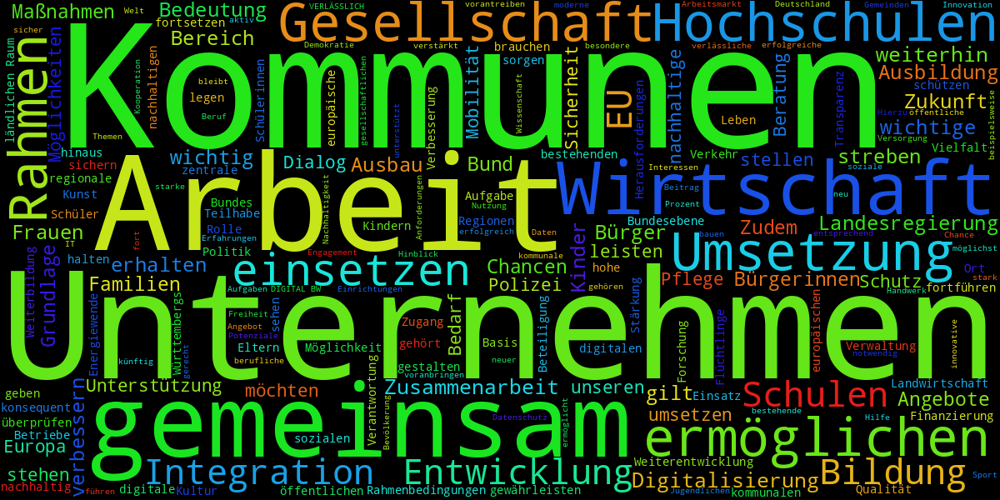
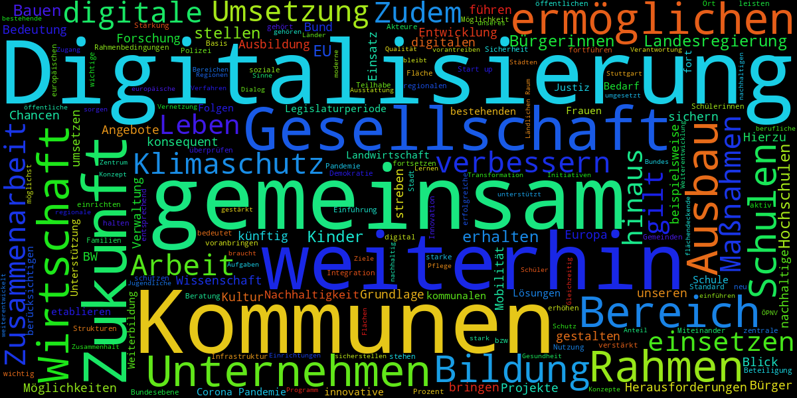

# Koalitionsvertrag 2021

* source: [210506_Koalitionsvertrag_2021-2026.pdf, Download am 2021-05-19](https://www.baden-wuerttemberg.de/fileadmin/redaktion/dateien/PDF/210506_Koalitionsvertrag_2021-2026.pdf)
* Text Extraktion via tika http://givemetext.okfnlabs.org/
* postprocessing mit sed skripten

```
sed -i -f postproc_wordwrap.sed tmp.txt
sed -i -f postproc_pagenumtit.sed tmp.txt
sed -i -f postproc_uppercasetitles.sed tmp.txt
sed -i -f postproc_possibletit.sed tmp.txt
```

* manuelle Zeilenzusammenführungen
* Überschriften-Markup überarbeitet
* Kapitelüberschriften im Text ergänzt, da dort nur Subtitel als Überschriften, Extraktion aus 210506_Koalitionsvertrag_2021-2026.md

```
grep -o '^[0-9]\.\+ [^0-9]*' 
```

* zu PDF wandeln (via `pandoc`)

```
./mdtopdf.sh 210506_Koalitionsvertrag_2021-2026.md
```

* Keywords extrahieren:

```
./extract_keywords.sh 'keyword1\|keyword2' # OR, any match of the keywords
./extract_keywords.sh 'keyword1.*keyword2' # keyword1[any text]keyword2
```    

# Koalitionsvertrag Baden-Württemberg 2016

Das Dokument 160509_Koalitionsvertrag_B-W_2016-2021_final.md ist eine (pandoc-)Markdown Variante des 
*Koalitionsvertrages zwischen Bündnis 90/Die Grünen Baden-Württemberg und der CDU Baden-Württemberg 2016 - 2021*.

Der Text wurde aus dem [PDF des Koalitionsvertrages](https://www.baden-wuerttemberg.de/fileadmin/redaktion/dateien/PDF/160509_Koalitionsvertrag_B-W_2016-2021_final.PDF)
 extrahiert.
Siehe auch die Pressemeldung *Grün-schwarzer Koalitionsvertrag unterzeichnet*: https://www.baden-wuerttemberg.de/de/service/presse/pressemitteilung/pid/gruen-schwarzer-koalitionsvertrag-unterzeichnet/

Für die Extraktion kam pdftotext zum Einsatz, einige reguläre Ausdrücke und oberflächliche händische Korrekturen, vor allem der Überschriften.
Es sind sicher noch Fehler enthalten, für deren Behebung gerne Pull-Requests gestellt werden können.

## Bugs

* einige Textteile tauchen offensichtlich an falscher Stelle auf (Textfluss PDF? teilweise nach Seitenumbruch)
    * unvollständige Sätze
* Trennzeichen am Zeilenende noch enthalten
* Überschriften sind in GROSSBUCHSTABEN (Inhaltsverzeichnis am Ende zu Korrektur nutzen?)
* gefundene Probleme sind in Kommentaren markiert


## Wordclouds






### creation of wordcloud

* prepare a python environment

```
mkvirtualenv wordcloud
pip3 install wordcloud
```

* get some stopword from a repo

```
git clone https://github.com/stopwords-iso/stopwords-de.git
# compile a stopwords file from a selection
cat ./stopwords_de_koalitionsvertrag.txt ./stopwords-de/raw/stop-words-german.txt ./stopwords-de/raw/language-resource-stopwords.txt ./stopwords-de/raw/stopwords-filter-de.txt > stopwords
```

* compute a wordcloud

```
wordcloud_cli --text 160509_Koalitionsvertrag_B-W_2016-2021_final.md --stopwords stopwords --imagefile wordcloud_koalitionsvertrag_2016.png --width 1200 --height 600
wordcloud_cli --text 210506_Koalitionsvertrag_2021-2026.md --stopwords stopwords --imagefile wordcloud_koalitionsvertrag_2021.png --width 1200 --height 600
```

